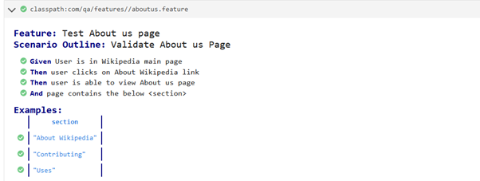
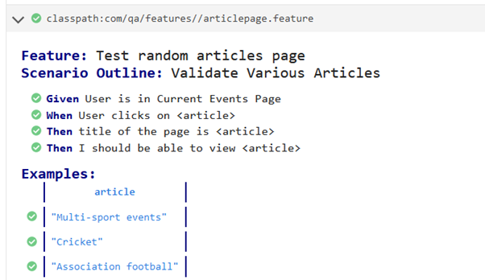
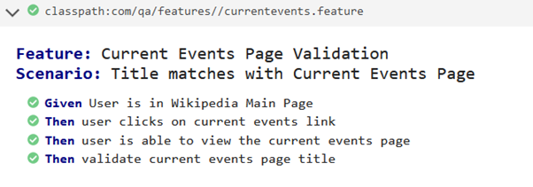
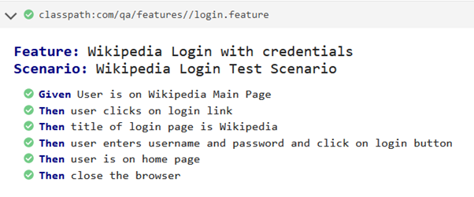

# Instructions to configure the development environment:

1.	Setup Java Development Kit Environment on Windows OS machine

2.	Install Eclipse IDE for Java Developers and as well as the plugins for Gherkin support - Cucumber and Natural.

3.	Create a New Maven Project – All of the dependencies are added in pom.xml

4.	The code structure used here is Page Object Model Design Pattern, hence the below structure of the code:

    i.	Create a package com.qa.config and under this create a file config.properties – where your browser name, url, username     and  password are defined

        For example:
        browser = chrome
        url = https://en.wikipedia.org/wiki/Main_Page
        username = KarunTest
        password = test@4321

    ii.	Create a package com.qa.features – where all your feature files reside

    iii.Create a package com.qa.pages – where all your Java class for each of the pages is defined

    iv.	Create a package com.qa.runner – where Testrunner class resides.

    v.	Create a package for Step Definitions com.qa.stepDefintions.

    vi.	Create a package util where Test Base and Test util classes are initialized.

5.	Target folder contains reporting. Please see this filein this folder cucumber-reports.html

## Improvements :

Some more scenarios can be added to each of the page and categorised into regression and smoke using the tags @smoke and @regression defined in feature file and in the Test runner class.

``` Java
@RunWith(Cucumber.class)
@CucumberOptions(
		features = {"classpath:com/qa/features/"},
		glue = {"com.qa.stepDefinitions" }, // the path of the step definition files
		plugin = { "pretty", "html:target/cucumber-reports.html" },
//		tags = "@smoke" “@regression”,
		monochrome = true,
		dryRun = false,
		stepNotifications = true
		)
```

## Reports








